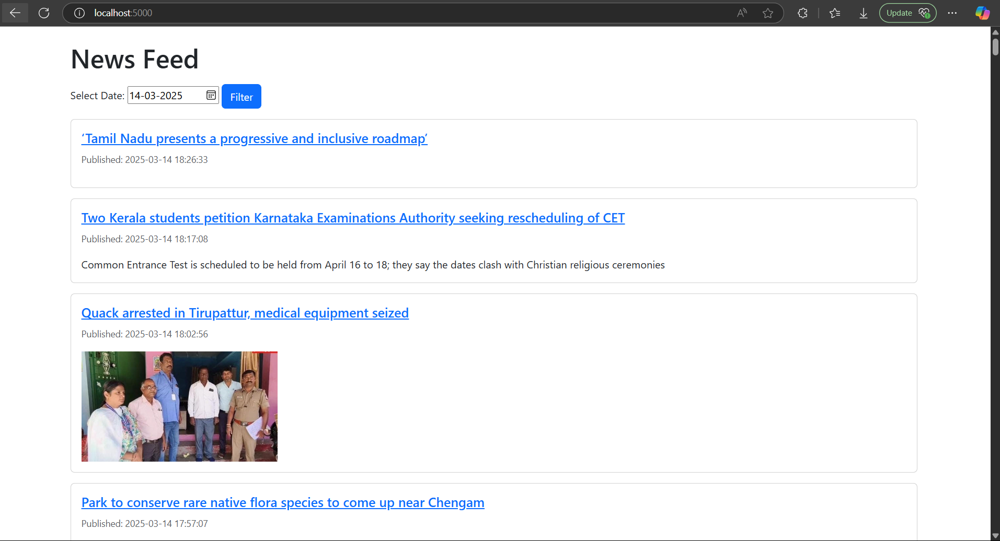

# DA5402 - Assignment 4
## Nikshay Jain | MM21B044

## **Overview**
This project is a **Dockerized RSS News Aggregator** that:
- **Fetches news articles** from an RSS feed (The Hindu News RSS) and stores them in a **PostgreSQL** database.
- **Provides a web interface** to view news articles (top 100 - limited by RSS) by selecting a date.
- Runs in a **fully containerized environment** with Docker, ensuring portability and easy deployment.

The system consists of three main services:
1. **`rss_reader`** - Periodically fetches news articles and inserts them into the database.
2. **`web_app`** - A Flask-based web app that allows users to filter and view news articles.
3. **`rss_db`** - A PostgreSQL database (in docker) for storing news articles.
---

## **Project Setup & Installation**

### **1. Prerequisites**
Ensure you have the following installed:
- **Docker** & **Docker Compose**
- **Python 3.9** (if running scripts locally for debugging)

### **2. Clone the Repository**
```sh
 git clone https://github.com/Nikshay-Jain/DA5402-Assign-4.git
```
Switch the directory to the project **root directory**.

### **3. Configure Environment Variables**
Update the `.env` file as needed:

#### **`.env` File Format:**
```
POSTGRES_DB=rss_database
POSTGRES_USER=rss_user
POSTGRES_PASSWORD=rss_password
RSS_FEED_URL=https://www.thehindu.com/news/national/?service=rss
FETCH_INTERVAL=600  # Interval in seconds (10 minutes default)
```

### **4. Build and Start the Containers**
```sh
docker-compose up --build -d
```

### **5. Access the Web App**
- Open your browser and visit: [`http://localhost:5000`](http://localhost:5000)

---

## **Project Architecture**
### **Folder Structure**
```
project_root
 ├── rss_reader/                # Fetches and inserts RSS news
 │   ├── rss_reader.py            # Main script for fetching news
 │   ├── requirements.txt         # Dependencies for rss_reader
 ├── web_app/                   # Flask web application
 │   ├── web_app.py               # Main web server
 │   ├── templates/index.html     # Web UI template
 │   ├── requirements.txt         # Dependencies for web_app
 ├── docker-compose.yaml       # Orchestrates multi-container setup
 ├── init-db.sql               # Creates the necessary tables
 ├── db-check.sh               # Ensures database is correctly set up
 ├── .env                      # Environment variables (database & config)
 ├── report.md                 # This file
```

### **System Architecture**
```
+-----------------+       +----------------+       +-----------------+
|  web_app (Flask)| <---> | rss_db (PostgreSQL) | <---> | rss_reader (Python)|
+-----------------+       +----------------+       +-----------------+
```

- `rss_reader` **fetches news from RSS feeds** and inserts it into `rss_db`.
- `web_app` **queries `rss_db`** to display news for the selected date.
- **Docker Compose manages** all three services.

---

## **Final project implementation**
- **Fetches and stores news articles** from an RSS feed.
- **Filters articles by date** and displays them via a web UI.
- **Prevents duplicate entries** in the database.
- **Ensures database persistence** using Docker volumes.
- **Fully containerized setup** with Docker Compose.

Screenshot of working project with UI:

---

## **🛠️ Debugging & Troubleshooting**

### **Check Running Containers**
```sh
docker ps
```
Its typical output should have 3 images activly running, viz.:
- assign4-rss_reader
- assign4-web_app
- postgres:latest

### **View Service Logs**
```sh
docker logs web_app --tail=50
```
```sh
docker logs rss_reader --tail=50
```
```sh
docker logs rss_db --tail=50
```

### **Restart Everything**
```sh
docker-compose down && docker-compose up -d
```

## **Key Highlights**
- **Runs in Docker** with PostgreSQL, Flask, and Python.
- **Fetches news from an RSS feed** and stores it persistently.
- **Web UI** allows filtering and viewing articles by date.
- **Debugging steps** & troubleshooting included.
